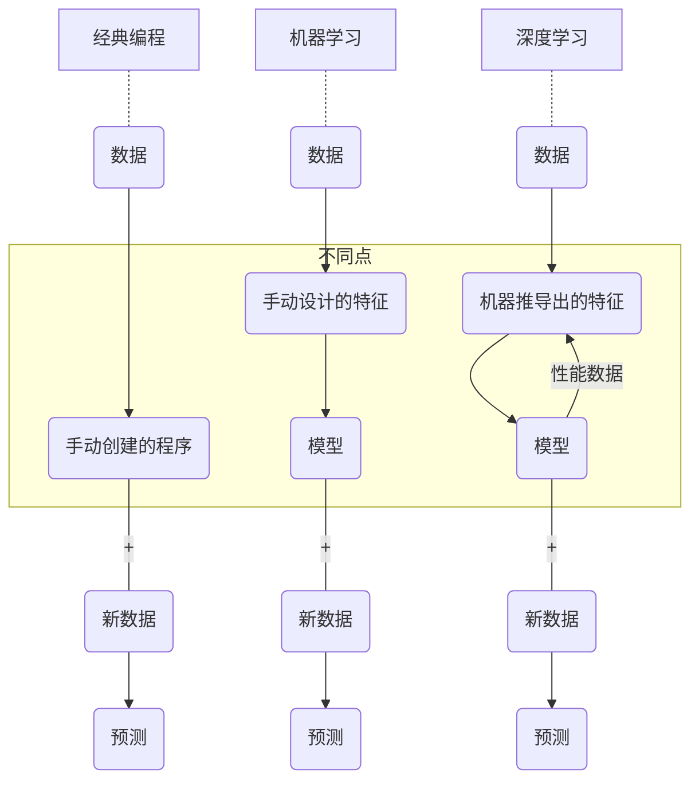

## 机器学习 (Machine Learning)

### 监督学习 (Supervised Learning)

监督学习是利用训练数据集学习一个模型，再利用模型对测试样本集进行预测。

- `二分类模型`: 预测出生小孩性别，输出结果只有两个维度 (男，女)
- `多分类模型`: 预测出生小孩性别，输出结果有多个维度 (男，女，不男不女)
- `回归模型`: 预测出生小孩性别概率，输出结果男的概率是多少，女的概率是多少

监督学习是最常见的机器学习方法。

### 无监督学习 (Unsupervised Learning)

机器需要通过自己发现聚类数据并`创建标签`，同时也可以进行人为分析，检查机器学习结果是否合理。

![[无监督学习.png]]

无监督学习一个经常见到的使用场景是`异常检测`，如`检测超速监控摄像机故障`。

![[无监督学习-检测超速监控摄像机故障.png]]

如图，这些异常值是`离群值`，但是否属于`硬件故障指标`？

若我们基于规则，设置某一阈值作为硬件故障判断指标，如车辆时速超过 250 公里，

那么我们会发现总会有个别车辆会超速，达到 250 公里/小时，这种情况也会被判断为摄像机硬件故障。

我们称这种现象为`假阳性`，因为基于规则判断此时摄像机故障，但实际上并没有。而`真阳性`则指的是`离群值`中大量集中出现的现象。

在原始数据中，并不会包含`摄像机是否故障`这样的数据集，这就需要`无监督学习`来帮助我们`创建标签`

### 强化学习 (Reinforcement Learning)

强化学习是通过`试错`的方式学习，即最好的期望结果已知，但实现结果的确切路径未知。

下图为 AWS DeepRacer 自动驾驶

![[aws-deepracer.png]]

目标是赛车能够以最快的速度通过整个赛道而不冲出赛道

因为不可能人为的去实际赛道训练试错采集数据，此时就需要用到 Virtual Environment

![[aws-deepracer-virtual-environment.png]]

在这个 Virtual Environment 内，有一个`代理` (即赛车)，允许代理在环境内部不断`行动`试错，

然后`环境`基于代理的行动给予一定的`奖励或惩罚`，如只要赛车不冲出赛道，就给它奖励，若需要跑得够快，就基于速度给予一定奖励，

代理在该环境中经过长时间的学习，它就会明白在哪种条件下可以获得更高的奖励，然后通过奖励不断的反馈优化模型，以达到最高积分。

### 深度学习 (Deep Learning)

![[deep-learning-1.png]]

`机器学习`主要基于统计学，通过历史数据统计规律。

`强化学习`也是基于统计学，不同点在于，强化学习是机器自我学习，自我采集数据，无需人为控制。

同样的，`深度学习`作为机器学习的一个子类别，也是基于统计学，不过相对于强化学习，它在算法方面发生了变化，引入了`人工神经网络`的概念。

如图，我们以下棋为例划分机器学习的类别，

![[deep-learning-2.png]]

- `人工智能`: 能够根据规则下棋的机器
- `机器学习`: 能够通过分析之前棋手的棋局学习下棋的机器
- `深度学习`: 能够通过与自己对弈学习下棋的机器

下图为深度学习的不同之处

在`经典编程`模式中，所有的规则通过手动创建程序，这其实是非常繁琐与复杂的。

到了`机器学习`之后，相较于`经典编程`，`机器学习`所能解决的问题会更多一点，预测也将更加精准，但是我们需要进行大量的`特征工程/数据过滤`，也就是我们常说的数据清洗 (Data Clean)。

如图片分类，我们需要提前设定，哪个特征是汽车，哪个特征是轮船，然后机器学习通过大量数据进行模型训练，最后对新图片进行预测。

`特征工程`这部分工作是异常繁琐的。

而到了`深度学习`之后，我们可以把`特征工程`这部分工作交给也交给机器自己去做，也就是`人工神经网络` 。

继续以图片分类为例，在`深度学习`中，我们只需要给予机器一张原图，并告诉机器这张图是一辆汽车，机器会自己从图片上去搜集相关特征，并将这些特征归类为汽车相关，然后利用这些特征去预测新图片。

相较于`机器学习`，`深度学习`极大的解放了`数据科学家/数据工程师`的工作量。

同时由于`机器学习`中的特征更多的是从人的视角去划分，对于机器来说并不一定能够理解，而`深度学习`中的特征来自于机器自我学习、自我分类，更易于机器理解，整个预测过程中的性能有了极大的提升。

#### DL 如何学习?

目前计算机科学中经常听到的`全连接网络`、`卷积神经网络`、`循环神经网络`等等，最早都是基于如下图的比较简单的`神经网络`。

`神经网络`的工作原理是模拟动物的神经系统的工作原理，将每一个点当成`神经元细胞`，最左边第一层为`输入层`，最右边为`输出曾`，中间的则为`隐藏层`，整个`神经网络`的计算能力取决于`隐藏层`具体有多复杂。

因此，哪怕输入层输入的数据相同，只要隐藏层不同，输出结果也不尽相同。

![[artificial-neural-network.png]]

下图为使用 ANN 进行图像分类的一个例子

![[example-of-artificial-neural-network.png]]

- `输入层`: 小狗的照片
- `隐藏层`: 基于色彩、灰度、渐变进行像素边缘分析，然后进行下一步的边角线条分析，绘制出对象部分特性，进行学习
- `输出层`: 基于分析学习结果，确认对象身份为小狗

#### 影响力

下图是由 ImageNet 举办的图片分类比赛，在 100 万张图像中识别出 1000 中事物。

![[imagenet-challenge.png]]

在 2010 年和 2011 年时候使用的是 `机器学习`，即使是最佳程序，在准确率方面也要远低于人类。

但是到了 2012 年，机器学习开始引入 `ANN`，机器学习的准确率开始大幅提升，并且在 2015 年超过人类。

这就是`深度学习`的影响力，以及它的强大之处。

#### 回顾

深度学习模型包括几大特性:

- 使用人工神经网络 (ANN) 学习
- 可以通过原始特征训练
- Machine Learning 方法的子集
- 针对计算效率安排的神经元
- 训练网络，包含数百个用于学习和改进特征的层

### 总结

- 经典编程与机器学习方法
- 三种机器学习算法
- 三种类型的监督 ML 问题
- 什么是 ML 的子类别，它与 ML 有何不同
- ML 解决方案可以解决哪些类型的问题

### 知识测验

1. 您需要根据公司员工的历史数据及其保留率确定可能离职的员工。您会使用哪种类型的机器学习来解决此问题 ?

    监督学习

2. 一家电影流媒体公司想要为每部电影贴上标签，将它们划分为不同的类型。他们拥有关于电影描述的历史资料和其他评论文章。他们可以使用哪种类型的 ML 解决此问题 ?

    A. 二元分类
    **B. 多类别分类**
    C. 回归
    D. 强化学习

## ML 管道 (ML Pipeline)


graph TB
    A(业务问题) --> B(问题定义) --> C(数据收集和整合)

    subgraph 数据准备和预处理
        C --> D(数据预处理和可视化)
    end

    D --> E(模型训练和优化) --> F(模型评估) --> G{是否符合业务目标?}

    G -.-> False[否]:::bg-red

    False -.- H(特征工程) -.-> E

    False -.- I(数据扩增) -.-> C

    classDef bg-red fill:#a44141;

    G -.-> True[是]:::bg-green

    True -.- J(模型部署) -.- K(新数据/重新训练) -.-> A

    classDef bg-green fill:#42b983


ML 不是适用于所有类型问题的解决方案

![[ML适用场景.png]]

机器学习可以满足各种业务需求

- 分类
- 预测性转接
- 欺诈检测
- 个性化广告
- 语音助理
- 动态定价
- 电子邮件筛选
- 自动驾驶汽车
- 客户流失预测

### 问题定义

> 示例: 某些产品库存积压，某些产品库存不足，分别导致开销增加和错过销售机会。

- 业务问题: 需求预测不准确，让企业蒙受损失
- 目标: 减少未售出的库存，不错过销售机会
- 成功指标: 每月月底未售出的库存不超过 15%，同时不存在库存不足

1. 什么是成功 ?

    将定性陈述转化为可衡量的定量陈述。

2. 希望模型产生什么实际输出 ?

    将问题转化为 ML 问题，如: 每个产品的预期库存需求都符合预测的销售数据。

    ![[ml-pipeline-1-1.png]]

3. 我们应该选择哪种模型 ?

    利用这一信息来确定要使用的机器学习问题类型。

    ![[ml-pipeline-1-2.png]]

4. 其他问题: 产品销量预测

    - 您想要确定自己是否应该将某种产品入库。

        您决定从库存中清除**销量会低于100件**的所有产品。

        这是一个**二元分类**问题。

    - 您想要确定每种商品最好在哪个月促销。

        这是一种**多元分类**问题。

### 选择数据

- 您有多少数据，位于哪里 ?
- 您能否访问这些数据 ?

- 您是否拥有解决问题所需的数据 ?
- 您的数据是否具有代表性 ?

- 评估数据质量

    ![[ml-pipeline-2-1.png]]

- 识别已有的特征和标签

    ![[ml-pipeline-2-2.png]]

- 是否需要大量带标记的数据 ?

    示例: 用于自动驾驶的训练数据需要大量标签。

    ![[ml-pipeline-2-3.png]]

    Amazon SageMaker Ground Truth 可以生成带标记的数据

### 成功标准

1. 模型效果指标
    - 在 ML 管道的**测试和评估**环节使用
    - 一般通过**准确度**来体现
    - 示例: 模型需要在测试数据集中准确识别出**至少 75% 的欺诈性交易**
2. 业务目标指标
    - 在**部署**模型后使用
    - 衡量模型**在真实环境中**的效果
    - 可以识别出**不当的模型效果指标**
    - 示例: 在模型部署六个月后，因欺诈交易而**注销信用卡的客户至少应该减少 50%**

### 案例研究: Amazon 呼叫中心问题

![[amazon呼叫中心问题.png]]

1. 业务问题

    如何将客户转接给正确的支持人员?

2. 问题定义

    识别客户数据中可用于预测准确客户转接的模式。

3. 数据收集和整合

    因为我们想要根据过去的客服电话数据进行预测，所以我们使用监督学习。

    ![[ml-pipeline-3.png]]

    - 特征
        - 客户最近订购了哪些产品
        - 客户是否拥有 Kindle ?
        - 客户是否是 Prime 会员 ？

4. 数据预处理和可视化

    此阶段包括数据清理和探索性数据分析。

    ![[ml-pipeline-4-1.png]]

    通过可视化分析更好地了解数据

    ![[ml-pipeline-4-2.png]]

5. 模型训练

    使用了 80% 的数据开发 (训练) 模型

    使用了 10% 的数据进行每次训练迭代，不断改进模型

    ![[ml-pipeline-5.png]]

6. 模型评估

    使用了 10% 的数据验证模型是否达到或超过必要的准确率

    - 第一次尝试时，它的电话转接准确率如何 ?
    - 平均有多少个电话需要重新转接 ?
    - 这些结果是否满足我们的业务需求 ?

    ![[ml-pipeline-6.png]]

7. 模型优化

    运行训练作业后，我们对模型进行了评估，然后开始对模型和数据进行迭代调整

8. 模型优化和特征工程

    ![[ml-pipeline-8.png]]

9. 模型部署

    ![[ml-pipeline-9.png]]

### 总结

- 说明问题定义阶段的第一步
- 列出必须考虑的一些与数据相关的因素
- 比较模型效果指标与业务目标指标

### 知识测验

- [Problem+Formulation+Exercise_CN](https://github.com/Oscaner/Study/blob/master/Exam/aws/mls-c01/51cto/docs/Problem%2BFormulation%2BExercise_CN.docx)

## 模型评估

### 均方差 (MSE)

WIP...
